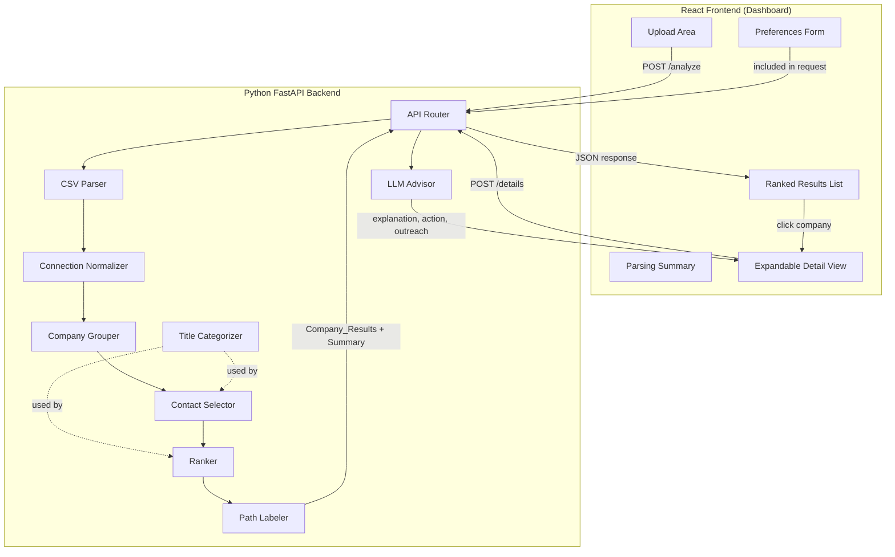

# Design Document — WarmPath MVP

## Overview

WarmPath MVP is a single-page web application that lets a job seeker upload their LinkedIn connections CSV, enter job preferences, and receive a ranked list of companies with the best contact at each, scored and labeled by referral strength. The system is split into a React frontend (Dashboard) and a Python FastAPI backend. All parsing, grouping, ranking, and contact selection is deterministic. An LLM is used only on-demand to generate explanations, next-action recommendations, and outreach drafts for individual selected companies.

The design prioritizes a 1-week hackathon timeline: modules are small, independently testable, and composed via a single orchestration endpoint.

## Architecture



### Separation of Concerns

| Layer | Responsibility | LLM? |
|-------|---------------|-------|
| CSV Parser | Read file, validate columns, produce raw rows | No |
| Connection Normalizer | Trim whitespace, parse dates, normalize fields | No |
| Company Grouper | Lowercase + suffix-strip matching, group records | No |
| Title Categorizer | Map position strings to broad categories | No |
| Contact Selector | Pick best contact per company group | No |
| Ranker | Score 0–100, sort descending | No |
| Path Labeler | Assign Warm/Stretch/Explore by threshold | No |
| LLM Advisor | Generate explanation, next action, outreach draft | **Yes** |

All modules except LLM Advisor are pure deterministic functions. This makes the core pipeline fast, testable, and reliable without any external API dependency.


## Components and Interfaces

### Backend Components

#### 1. CSV Parser (`csv_parser.py`)

Reads the uploaded file and produces raw row dicts.

- Accepts a file-like object (from FastAPI `UploadFile`)
- Skips the LinkedIn "Notes:" preamble lines that precede the actual CSV header (the real header row starts with `First Name,Last Name,...`)
- Validates that required columns exist: `First Name`, `Last Name`, `URL`, `Email Address`, `Company`, `Position`, `Connected On`
- Returns a list of raw row dicts and a count of total rows

```python
def parse_csv(file: BinaryIO) -> tuple[list[dict[str, str]], int]:
    """Returns (rows, total_row_count). Raises ValueError on missing columns."""
```

#### 2. Connection Normalizer (`normalizer.py`)

Converts raw row dicts into `Connection_Record` objects.

- Trims whitespace on all string fields
- Parses `Connected On` (format: `"18 Mar 2026"`) into `datetime.date` (ISO 8601)
- Sets `email` to `None` when the field is empty
- Excludes rows where `company` is empty after trimming
- Tracks excluded rows with reasons

```python
def normalize_connections(rows: list[dict]) -> tuple[list[ConnectionRecord], list[ExcludedRow]]:
    """Returns (valid_records, excluded_rows)."""
```

#### 3. Company Grouper (`grouper.py`)

Groups `Connection_Record` objects by normalized company name.

- Normalization: lowercase, strip whitespace, optionally remove trailing legal suffixes from a safe set: `inc`, `llc`, `ltd`, `corp`, `corporation`, `co`, `company`, `plc`, `lp`
- Suffix removal only when the suffix appears as the last word (with optional trailing period/comma)
- Returns a dict mapping normalized company name → list of `Connection_Record`, plus the display name (original casing from the first record seen)

```python
def group_by_company(records: list[ConnectionRecord]) -> dict[str, CompanyGroup]:
    """Returns {normalized_name: CompanyGroup}."""
```

#### 4. Title Categorizer (`title_categorizer.py`)

Maps a position string to a broad category using keyword matching.

Categories and example keywords:
- `technical`: engineer, developer, architect, data, scientist, analyst, sde, swe, devops, qa
- `recruiting`: recruiter, talent, hiring, staffing, hr, human resources
- `leadership`: director, vp, president, ceo, cto, cfo, head of, manager, lead, principal
- `student`: student, intern, fellow, apprentice, graduate assistant
- `unknown`: fallback when no keywords match

```python
def categorize_title(position: str) -> str:
    """Returns one of: 'technical', 'recruiting', 'leadership', 'student', 'unknown'."""
```

#### 5. Contact Selector (`contact_selector.py`)

Picks the single best contact from a company group.

Scoring per contact:
1. **Title relevance** (primary): keyword overlap between the contact's position and the user's target role keywords. Score 0–10.
2. **Title category bonus**: if the contact's category matches a preferred category for the target role (e.g., `recruiting` or `technical` for a software role), add +2.
3. **Email bonus**: +1 if email is non-null.
4. **Recency tie-breaker**: when scores are equal, prefer the contact with the later `connected_on` date.

```python
def select_best_contact(group: CompanyGroup, target_role_keywords: list[str]) -> ContactSelection:
    """Returns the selected ConnectionRecord and its selection score."""
```

#### 6. Ranker (`ranker.py`)

Computes a 0–100 relevance score for each company.

Scoring breakdown:
- **Title relevance** (0–60 points): based on the best contact's title-relevance score, scaled to 60. This is the primary signal.
- **Title category bonus** (0–15 points): if the best contact's title category is `recruiting` (+15), `technical` (+10), `leadership` (+5), `student` (+0), `unknown` (+0). Adjusted based on target role context.
- **Location adjustment** (0–10 points): if the user specified a preferred location AND location-related text appears in the contact's position field, add up to 10 points. If no location is specified or no signal found, add 0.
- **Company-type adjustment** (0–5 points): if the user specified a company-type preference other than "any" AND the company appears in a small static lookup mapping company names to types, add 5 for a match. Otherwise add 0.
- **Email availability bonus** (0–5 points): +5 if the best contact has an email address.
- **Normalization**: raw score is clamped to 0–100.

Sorting:
1. Descending by score
2. Alphabetically by company name on ties

```python
def rank_companies(
    groups: dict[str, CompanyGroup],
    selections: dict[str, ContactSelection],
    preferences: Preferences,
) -> list[CompanyResult]:
    """Returns sorted list of CompanyResult."""
```

#### 7. Path Labeler (`path_labeler.py`)

Assigns a label based on deterministic thresholds:
- Score ≥ 70 → `"Warm Path"`
- Score 40–69 → `"Stretch Path"`
- Score < 40 → `"Explore"`

```python
def label_path(score: int) -> str:
    """Returns 'Warm Path', 'Stretch Path', or 'Explore'."""
```

#### 8. LLM Advisor (`llm_advisor.py`)

Generates three text outputs for a single company result using an LLM API call.

- **Input to prompt**: company name, best contact name + title, path label, score, user's target role, preferred location, company-type preference, whether email is available
- **Outputs**: explanation (2–3 sentences), next action (1 sentence), outreach draft (3–5 sentences)
- **Fallback on error/timeout**: returns static defaults:
  - Explanation: `"Relevance based on your preferences."`
  - Next action: `"Reach out via LinkedIn message."`
  - Outreach: template with `{contact_name}`, `{company}`, `{target_role}` placeholders
- LLM provider: configurable via `LLM_API_KEY` and `LLM_MODEL` environment variables (e.g., OpenAI GPT-4o-mini for cost efficiency)

```python
async def generate_details(company_result: CompanyResult, preferences: Preferences) -> LLMDetails:
    """Returns LLMDetails with explanation, next_action, outreach_draft."""
```

#### 9. API Routes (`api.py`)

Two endpoints:

**`POST /api/analyze`** — Main pipeline endpoint
- Accepts: multipart form with CSV file + JSON preferences
- Orchestrates: CSV Parser → Normalizer → Grouper → Title Categorizer → Contact Selector → Ranker → Path Labeler
- Returns: `{ parsing_summary: ParsingSummary, results: CompanyResult[] }`

**`POST /api/details`** — LLM details endpoint
- Accepts: JSON with a single `CompanyResult` + `Preferences`
- Calls LLM Advisor
- Returns: `{ explanation: str, next_action: str, outreach_draft: str }`

### Frontend Components

#### Dashboard Layout (single page)

```
┌─────────────────────────────────────────────┐
│  WarmPath — Find Your Warm Paths            │
├─────────────────────────────────────────────┤
│  [Upload CSV]  [Target Role] [Location]     │
│               [Company Type ▼]  [Analyze]   │
├─────────────────────────────────────────────┤
│  Parsing Summary: 150 rows | 142 valid |    │
│  8 excluded | 87 unique companies           │
├─────────────────────────────────────────────┤
│  ● Company A  — J. Smith, SDE    🟢 Warm 82│
│  ● Company B  — A. Lee, Recruiter 🟡 Str 55│
│  ● Company C  — M. Doe, Intern   ⚪ Exp 28 │
│  ...                                        │
│  [Show More]                                │
├─────────────────────────────────────────────┤
│  ▼ Expanded Detail (on click):              │
│    Explanation: ...                          │
│    Next Action: ...                          │
│    Outreach Draft: ...        [📋 Copy]     │
└─────────────────────────────────────────────┘
```

#### Component Breakdown

1. **UploadArea** — File input for CSV, drag-and-drop optional. Sends file to parent on selection.
2. **PreferencesForm** — Three fields: target role (text), location (text), company type (dropdown). Validates that target role is non-empty before submit.
3. **ParsingSummary** — Displays stats bar: total rows, valid connections, excluded rows, unique companies. Shown after successful analysis.
4. **ResultsList** — Scrollable list of `CompanyResultCard` components. Initially shows top 25 (configurable N). "Show More" button loads next batch.
5. **CompanyResultCard** — Displays company name, contact name + title, path label (color-coded badge), score. Clickable to expand.
6. **DetailView** — Expanded panel below the card. Shows explanation, next action, outreach draft. Triggers `POST /api/details` on first expand (lazy loading). Includes copy-to-clipboard button for outreach text.
7. **ErrorAlert** — Dismissible banner for API errors.
8. **LoadingIndicator** — Spinner/progress bar shown during API calls.


## Data Models

### Connection_Record

Represents one normalized LinkedIn connection.

```python
@dataclass
class ConnectionRecord:
    first_name: str
    last_name: str
    full_name: str          # "{first_name} {last_name}"
    url: str                # LinkedIn profile URL
    email: str | None       # None if not provided
    company: str            # Original company name (trimmed)
    position: str           # Original position title (trimmed)
    connected_on: date      # Parsed from "DD Mon YYYY"
    title_category: str     # One of: technical, recruiting, leadership, student, unknown
```

### Preferences

User-supplied job search parameters.

```python
@dataclass
class Preferences:
    target_role: str            # Free text, required (e.g., "software engineer")
    location: str               # Free text, optional (empty string = unspecified)
    company_type: str           # One of: "startup", "mid-size", "enterprise", "any"
```

### CompanyGroup

Internal grouping structure.

```python
@dataclass
class CompanyGroup:
    normalized_name: str                # Lowercased, suffix-stripped key
    display_name: str                   # Original casing from first record
    contacts: list[ConnectionRecord]    # All connections at this company
```

### ContactSelection

Result of best-contact selection for one company.

```python
@dataclass
class ContactSelection:
    contact: ConnectionRecord
    selection_score: float      # Internal score used for selection
```

### CompanyResult

Output object for one company in the ranked results.

```python
@dataclass
class CompanyResult:
    company_name: str           # Display name
    contact_name: str           # Best contact full name
    contact_title: str          # Best contact position
    contact_url: str            # Best contact LinkedIn URL
    contact_email: str | None   # Best contact email (nullable)
    path_label: str             # "Warm Path" | "Stretch Path" | "Explore"
    score: int                  # 0–100
    contact_count: int          # Number of connections at this company
```

### ParsingSummary

Statistics returned after CSV processing.

```python
@dataclass
class ParsingSummary:
    total_rows: int             # Total data rows in CSV (excluding header/notes)
    valid_connections: int      # Rows that produced a ConnectionRecord
    excluded_rows: int          # Rows excluded (with reasons)
    exclusion_reasons: list[ExcludedRow]  # Detail per excluded row
    unique_companies: int       # Distinct normalized company names
```

### ExcludedRow

```python
@dataclass
class ExcludedRow:
    row_number: int
    reason: str                 # e.g., "Empty company field"
```

### LLMDetails

Response from the LLM Advisor.

```python
@dataclass
class LLMDetails:
    explanation: str            # 2–3 sentences
    next_action: str            # 1 sentence
    outreach_draft: str         # 3–5 sentences
```

## API Design

### `POST /api/analyze`

Main pipeline endpoint. Accepts CSV + preferences, returns ranked results.

**Request**: `multipart/form-data`

| Field | Type | Required | Description |
|-------|------|----------|-------------|
| `file` | File | Yes | LinkedIn connections CSV |
| `preferences` | JSON string | Yes | Serialized Preferences object |

Preferences JSON example:
```json
{
  "target_role": "software engineer",
  "location": "Seattle",
  "company_type": "startup"
}
```

**Response**: `200 OK`
```json
{
  "parsing_summary": {
    "total_rows": 150,
    "valid_connections": 142,
    "excluded_rows": 8,
    "exclusion_reasons": [
      { "row_number": 5, "reason": "Empty company field" },
      { "row_number": 12, "reason": "Empty company field" }
    ],
    "unique_companies": 87
  },
  "results": [
    {
      "company_name": "Amazon Web Services (AWS)",
      "contact_name": "Aditi Dandekar",
      "contact_title": "Software Development Engineer",
      "contact_url": "https://www.linkedin.com/in/aditidandekar",
      "contact_email": null,
      "path_label": "Warm Path",
      "score": 82,
      "contact_count": 3
    }
  ]
}
```

**Error Responses**:
- `400 Bad Request`: invalid CSV, missing columns, empty target role
- `422 Unprocessable Entity`: malformed preferences JSON
- `500 Internal Server Error`: unexpected processing failure

### `POST /api/details`

LLM-powered details for a selected company.

**Request**: `application/json`
```json
{
  "company_result": {
    "company_name": "Amazon Web Services (AWS)",
    "contact_name": "Aditi Dandekar",
    "contact_title": "Software Development Engineer",
    "contact_url": "https://www.linkedin.com/in/aditidandekar",
    "contact_email": null,
    "path_label": "Warm Path",
    "score": 82,
    "contact_count": 3
  },
  "preferences": {
    "target_role": "software engineer",
    "location": "Seattle",
    "company_type": "startup"
  }
}
```

**Response**: `200 OK`
```json
{
  "explanation": "AWS has a strong engineering culture and your contact Aditi is an SDE, making this a direct peer referral opportunity. Her role aligns closely with your target.",
  "next_action": "Send a LinkedIn message referencing your shared connection and interest in SDE roles at AWS.",
  "outreach_draft": "Hi Aditi, I hope you're doing well! I'm currently exploring software engineering opportunities and noticed we're connected on LinkedIn. I'd love to learn more about your experience at AWS. Would you be open to a brief chat about the team and culture? Thanks so much!"
}
```

**Error Response**: `200 OK` with fallback content (never fails to the client):
```json
{
  "explanation": "Relevance based on your preferences.",
  "next_action": "Reach out via LinkedIn message.",
  "outreach_draft": "Hi {contact_name}, I noticed we're connected on LinkedIn. I'm exploring {target_role} opportunities and would love to learn about your experience at {company}. Would you be open to a quick chat?"
}
```

## Ranking Design

### Score Composition (0–100)

| Signal | Points | Condition |
|--------|--------|-----------|
| Title relevance | 0–60 | Keyword overlap between best contact's position and target role |
| Title category bonus | 0–15 | Category of best contact's title relative to target role |
| Location match | 0–10 | Location text found in position field, only if user specified location |
| Company-type match | 0–5 | Static lookup match, only if user specified type ≠ "any" |
| Email availability | 0–5 | Best contact has a non-null email |
| **Total** | **0–95 raw** | Clamped to 0–100 |

### Title Relevance Scoring (0–60)

1. Tokenize the user's target role into keywords (e.g., `"software engineer"` → `["software", "engineer"]`)
2. Tokenize the contact's position into words
3. Count matching keywords (case-insensitive)
4. Score = `(matches / total_keywords) * 60`, rounded to nearest integer
5. Minimum score of 5 if the contact's title category is `recruiting` (recruiters are always somewhat relevant)

### Title Category Bonus (0–15)

The bonus depends on the target role context:
- If target role contains technical keywords → `recruiting` +15, `technical` +10, `leadership` +5
- If target role contains non-technical keywords → `recruiting` +15, `leadership` +10, `technical` +5
- `student` and `unknown` always +0

### Location Adjustment (0–10)

- Only applied when `preferences.location` is non-empty
- Simple substring match: check if the location string appears in the contact's position field (case-insensitive)
- If match found: +10. Otherwise: +0.
- This is a rough heuristic — many positions don't include location text, so most companies will get +0 here. That's fine for MVP.

### Company-Type Adjustment (0–5)

- A small static dict maps known company names to types: `{"google": "enterprise", "meta": "enterprise", "stripe": "startup", ...}`
- Only consulted when `preferences.company_type` is not `"any"`
- If the normalized company name is in the dict and matches the preference: +5
- If not in the dict or doesn't match: +0
- The dict is intentionally small (~20–50 entries) and can be extended later

### Tie-Breaking

When two companies have the same final score:
1. Sort alphabetically by display company name (ascending)

### Best Contact Selection Logic

Within each company group, contacts are scored:
1. Title-relevance keyword overlap (0–10)
2. Title category bonus (+2 if category matches preferred category)
3. Email bonus (+1 if email present)
4. Tie-breaker: more recent `connected_on` date wins

The highest-scoring contact is selected. This is independent of the company-level ranking.

## LLM Design

### When LLM Is Called

- **Not** during the main `/api/analyze` pipeline — all results are returned without LLM
- Only when the user clicks on a specific company result in the Dashboard, triggering `POST /api/details`
- This keeps the main flow fast and avoids LLM costs for companies the user never looks at

### Prompt Construction

The LLM receives a single structured prompt with:
- User's target role, location, company-type preference
- Company name, best contact name + title, path label, score
- Whether email is available
- Instructions to produce exactly three outputs: explanation, next action, outreach draft

Example prompt template:
```
You are a career networking advisor. Given the following context, produce three outputs.

Context:
- Job seeker's target role: {target_role}
- Preferred location: {location}
- Company type preference: {company_type}
- Company: {company_name}
- Contact: {contact_name}, {contact_title}
- Path strength: {path_label} (score: {score}/100)
- Email available: {yes/no}

Produce:
1. EXPLANATION (2-3 sentences): Why this company/contact is relevant.
2. NEXT ACTION (1 sentence): The recommended next step, considering whether email is available.
3. OUTREACH DRAFT (3-5 sentences): A personalized message to the contact.

Format your response as JSON: {"explanation": "...", "next_action": "...", "outreach_draft": "..."}
```

### LLM Provider

- Use OpenAI API (or compatible) via `openai` Python package
- Model: `gpt-4o-mini` for cost efficiency (configurable via `LLM_MODEL` env var)
- API key via `LLM_API_KEY` env var
- Timeout: 15 seconds

### Fallback Behavior

If the LLM call fails (network error, timeout, malformed response, missing API key):
- Return static fallback content immediately
- Log the error server-side
- The user sees usable (if generic) content — the app never breaks

### Keeping LLM Usage Minimal

- Zero LLM calls in the main pipeline
- At most 1 LLM call per user click (per company detail view)
- Results are cached in-memory for the session so re-expanding the same company doesn't re-call the LLM
- No batch LLM processing of all results


## Correctness Properties

*A property is a characteristic or behavior that should hold true across all valid executions of a system — essentially, a formal statement about what the system should do. Properties serve as the bridge between human-readable specifications and machine-verifiable correctness guarantees.*

### Property 1: CSV column validation identifies missing columns

*For any* CSV file with a subset of the required columns missing, the parser should reject the file and the error message should identify exactly the set of columns that are missing.

**Validates: Requirements 1.2, 1.3**

### Property 2: Normalization trims whitespace and handles empty fields

*For any* raw CSV row, the resulting Connection_Record (if not excluded) should have all string fields trimmed of leading and trailing whitespace, rows with empty company fields should be excluded, and rows with empty email fields should be retained with email set to null.

**Validates: Requirements 1.4, 1.5, 1.6**

### Property 3: Date parsing round trip

*For any* valid date in "DD Mon YYYY" format, parsing it into a date object and formatting it back should produce the original date values (day, month, year).

**Validates: Requirements 1.7**

### Property 4: Parsing summary counts are consistent

*For any* parsed CSV, the parsing summary should satisfy: `total_rows == valid_connections + excluded_rows`, and `unique_companies` should equal the number of distinct normalized company names among valid connections.

**Validates: Requirements 1.8**

### Property 5: Company grouping is a valid partition

*For any* list of Connection_Records, the Company_Grouper should produce groups such that: every input record appears in exactly one group, all records within a group share the same normalized company name, and no group is empty.

**Validates: Requirements 3.1, 3.3, 3.4**

### Property 6: Company name normalization is consistent

*For any* two company name strings that differ only by leading/trailing whitespace, letter casing, or a trailing legal suffix (from the safe set), the normalized form should be identical.

**Validates: Requirements 3.2**

### Property 7: Contact selector picks exactly one contact with highest composite score

*For any* non-empty company group and target role keywords, the Contact_Selector should return exactly one contact, and that contact should have a composite score (title relevance + email bonus) greater than or equal to every other contact in the group. When scores are tied, the selected contact should have the latest connected_on date.

**Validates: Requirements 4.1, 4.2, 4.3, 4.4, 4.6**

### Property 8: Title categorization returns exactly one valid category

*For any* position string, the title categorizer should return exactly one value from the set {technical, recruiting, leadership, student, unknown}.

**Validates: Requirements 4.5**

### Property 9: Relevance scores are in range 0–100

*For any* company result produced by the Ranker, the relevance score should be an integer in the range [0, 100].

**Validates: Requirements 5.1**

### Property 10: Ranked results are sorted by score descending then alphabetically

*For any* list of ranked company results, each result's score should be greater than or equal to the next result's score. When two adjacent results have equal scores, the first should be alphabetically less than or equal to the second by company name.

**Validates: Requirements 5.5, 5.6**

### Property 11: Location and company-type adjustments are conditional

*For any* set of company results, when the user's preferred location is empty the location score component should be 0 for all companies, and when company-type preference is "any" the company-type score component should be 0 for all companies.

**Validates: Requirements 2.4, 2.5, 5.3, 5.4**

### Property 12: Path label is determined by score thresholds

*For any* integer score in [0, 100], the path label should be "Warm Path" if score ≥ 70, "Stretch Path" if 40 ≤ score ≤ 69, and "Explore" if score < 40.

**Validates: Requirements 6.1, 6.2, 6.3, 6.4**

### Property 13: API response contains all required fields

*For any* successful API response from `/api/analyze`, each element in the results array should contain: company_name (string), contact_name (string), contact_title (string), contact_url (string), contact_email (string or null), path_label (one of the three valid labels), score (integer 0–100), and contact_count (positive integer). The response should also include a valid parsing_summary object.

**Validates: Requirements 9.2, 9.3**


## Error Handling

### CSV Parsing Errors

| Condition | Behavior | HTTP Status |
|-----------|----------|-------------|
| File is not valid CSV (binary, corrupt) | Return error: `"Uploaded file is not a valid CSV"` | 400 |
| Missing required columns | Return error listing missing columns: `"Missing columns: Email Address, Position"` | 400 |
| LinkedIn "Notes:" preamble present | Skip preamble lines, find actual header row starting with `First Name` | N/A (handled) |
| Empty Company field in a row | Exclude row, record reason `"Empty company field"` in exclusion list | N/A (handled) |
| Empty Email Address field | Retain record with `email = null` | N/A (handled) |
| Unparseable Connected On date | Exclude row, record reason `"Invalid date format"` | N/A (handled) |
| CSV has zero valid rows after filtering | Return success with empty results array and summary showing 0 valid connections | 200 |
| File is empty (no rows at all) | Return error: `"CSV file contains no data rows"` | 400 |

### Preferences Validation Errors

| Condition | Behavior | HTTP Status |
|-----------|----------|-------------|
| Target role is empty or whitespace-only | Return error: `"Target role is required"` | 400 |
| Malformed preferences JSON | Return error: `"Invalid preferences format"` | 422 |
| Location is empty | Treat as unspecified, skip location scoring | N/A (valid) |
| Company type is "any" | Skip company-type scoring | N/A (valid) |

### LLM Errors

| Condition | Behavior | HTTP Status |
|-----------|----------|-------------|
| LLM API key not configured | Return fallback content, log warning | 200 |
| LLM API timeout (>15s) | Return fallback content, log error | 200 |
| LLM returns malformed JSON | Return fallback content, log error | 200 |
| LLM network error | Return fallback content, log error | 200 |

The `/api/details` endpoint never returns an error to the client. It always returns usable content, falling back to static templates when the LLM is unavailable.

### General API Errors

| Condition | Behavior | HTTP Status |
|-----------|----------|-------------|
| Unexpected server error | Return error: `"Internal server error"` with generic message | 500 |
| Request too large (file size) | Return error: `"File too large"` (limit: 10MB for MVP) | 413 |

## Explicit Tradeoffs — MVP Simplifications

### Intentionally Simplified for MVP

| Area | Simplification | Rationale |
|------|---------------|-----------|
| Company normalization | Only trim, lowercase, and remove a small safe set of suffixes. No fuzzy matching, no abbreviation expansion (e.g., "AWS" ≠ "Amazon Web Services") | Fuzzy matching is complex and error-prone. Simple normalization covers the majority case. |
| Title categorization | Keyword-based matching into 5 broad categories. No NLP, no ML. | Good enough for scoring signals. Keyword lists can be extended easily. |
| Location scoring | Substring match in position field only. No geocoding, no company HQ lookup. | Most LinkedIn positions don't include location. A rough signal is better than none. |
| Company-type lookup | Small static dict (~20–50 entries). No live API calls to Crunchbase etc. | Sufficient for demo. Easy to extend the dict. |
| LLM usage | On-demand per company click only. No batch processing. | Keeps costs low and response time fast for the main pipeline. |
| Storage | No persistence between sessions. Each upload is fresh. | Simplifies architecture. No database needed. |
| Authentication | None. Single-user local tool. | Not needed for hackathon demo. |
| Mobile design | Desktop-only layout. | Demo will be on a laptop. |
| Second-degree connections | Not supported. First-degree only. | Would require LinkedIn API access or graph traversal. |
| CSV format | Only LinkedIn's standard export format. No other CSV layouts. | One format to support, one parser to write. |

### Deferred to Future Versions

- Fuzzy company name matching (Levenshtein distance, abbreviation mapping)
- Second-degree connection graph analysis
- Live company data enrichment (Crunchbase, LinkedIn API)
- User accounts and session persistence
- Batch LLM generation for top N results
- Export results to CSV/PDF
- Mobile-responsive design
- Multi-language outreach drafts
- Custom scoring weight configuration by user

## Testing Strategy

### Dual Testing Approach

WarmPath uses both unit tests and property-based tests for comprehensive coverage:

- **Unit tests**: Verify specific examples, edge cases, and error conditions with known inputs and expected outputs
- **Property-based tests**: Verify universal properties across randomly generated inputs using a PBT library

Both are complementary. Unit tests catch concrete bugs and document expected behavior. Property tests verify general correctness across the input space.

### Property-Based Testing Configuration

- **Library**: [Hypothesis](https://hypothesis.readthedocs.io/) for Python backend tests
- **Minimum iterations**: 100 per property test (via `@settings(max_examples=100)`)
- **Each property test references its design property** with a tag comment:
  ```python
  # Feature: warmpath-mvp, Property 1: CSV column validation identifies missing columns
  ```
- **Each correctness property is implemented by a single property-based test**

### Frontend Testing

- **Library**: Jest + React Testing Library
- **Property-based testing**: [fast-check](https://github.com/dubzzz/fast-check) for JavaScript property tests
- **Focus**: Component rendering, user interactions, API integration mocking

### Test Plan by Module

| Module | Unit Tests | Property Tests |
|--------|-----------|----------------|
| CSV Parser | Valid file parsing, preamble skipping, specific error messages | Property 1 (column validation), Property 2 (normalization), Property 3 (date round trip) |
| Company Grouper | Known grouping examples, suffix removal cases | Property 4 (summary counts), Property 5 (partition), Property 6 (name normalization) |
| Contact Selector | Known selection scenarios, tie-breaking examples | Property 7 (best contact selection) |
| Title Categorizer | Known title → category mappings | Property 8 (valid category output) |
| Ranker | Known scoring scenarios, sort order examples | Property 9 (score range), Property 10 (sort order), Property 11 (conditional adjustments) |
| Path Labeler | Boundary values (39, 40, 69, 70) | Property 12 (threshold labels) |
| API Routes | Integration tests with sample CSV | Property 13 (response schema) |
| LLM Advisor | Mock LLM responses, fallback on error | Unit tests only (LLM output is non-deterministic) |
| Dashboard | Component rendering, click interactions, loading states | Unit tests + fast-check for result card rendering |

### Edge Cases for Unit Tests

- CSV with only the Notes preamble and no data rows
- CSV with all rows having empty Company fields (zero valid results)
- Company group with a single contact (trivial selection)
- All companies scoring the same (alphabetical sort)
- Scores at exact threshold boundaries (39, 40, 69, 70)
- Contact with no email and no position
- Very long company names or position titles
- Unicode characters in names and titles
- Connected On dates at various formats or edge dates
